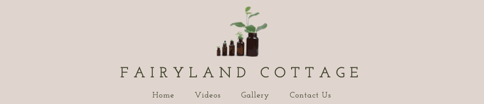

# FAIRYLAND COTTAGE - NEW WEBSITE

## Description

This project website is a resource for individuals interested in living a simple and sustainable lifestyle. It offers a variety of information on topics such as healthy recipes, homemade natural products, DIY projects, and zero waste living. Whether you are a seasoned follower of the _Fairyland Cottage_ or a newcomer looking to learn more, this website provides valuable insights and inspiration for anyone interested in simplifying their life.


## Table of Content

1. [User Stories](#user-stories)

2. [Visual Design](#visual-design)

3. [Features](#features)

4. [Technologies](#technologies)

5. [Manual Testing](#manual-testing)

6. [Deployment](#deployment)

7. [Credits](#credits)

8. [Author](#author)

<hr>

## [User Stories](#user-stories)

### Short Brief

I wanted a website for users old and new to able explore the world of _Fairyland Cottage_ without having to go to different sites / apps. If they wish to see more they have the option through our links provided.
On the home page we give a warming welcome note and a insight into simply living. This allows the new user to get a strong understanding of what information is available.

#### Users views

1. As a user, I want to easily navigate through the website to find the information I am looking for, so I can quickly access the world of _Fairyland Cottage_ resources on simple living and sustainability.

2. As a newcomer to _Fairyland Cottage_, I want to learn more about the ethos of simple living and sustainability, so I can understand the principles and values behind the content shared on the website.

3. As a user interested in zero waste living, I want to discover tips and ideas on how to reduce waste and live a more eco-friendly lifestyle, so I can make positive changes in my daily habits.

4. As a fan of _Fairyland Cottage_, I want to stay connected with the community through social media links, so I can engage with like-minded individuals and be inspired by their stories and experiences.

5. As a visitor to the website, I want to feel inspired and motivated to adopt a more sustainable lifestyle, so I can contribute to a healthier planet for future generations.

## [Visual Design](#visual-design)

### Wireframes

- Small Screen / Mobile

  |                                          Visual idea                                          |     Page     |
  | :-------------------------------------------------------------------------------------------: | :----------: |
  |     | Landing page |
  |      |   Side bar   |
  |   | Gallery page |
  |   |    Videos    |
  |  |  Contact Us  |

  <hr>

- Screen sizes 768px and up

  |                                   Visual idea                                   |     Page     |
  | :-----------------------------------------------------------------------------: | :----------: |
  |     | Landing page |
  |  | Gallery page |
  |    |    Videos    |
  |  |  Contact Us  |

  ### Font

  The font that I chose for the full site is [Josefin Slab](https://fonts.google.com/?query=Josefin+Slab). The reasoning behind this choice is to keep in form with the original font used for the existing [Fairyland Cottage website](https://www.fairylandcottage.com/) where Papyrus was the main font. Unfortunately google fonts did not offer this option, so I found a good [blog](https://appsthatdeliver.com/app-tutorials/google-docs/papyrus-font-google-docs/) that offered alternative fonts that held a similarity to the font design Papyrus.

  I aimed to create a seamless transition for returning users, evoking a sense of familiarity with the world of Fairyland, while new visitors are welcomed with the organic and earthy aesthetic of Josefin Slab font, enhancing their reading and browsing experience on the site.

  

  ### Icons

  - The icons I used are from the [Fontawesome]() Icon library using the <<i>i</i>> tag.

  - They are utalised is the footer on pages 768px and up. While added to the side bar on mobile devices.

  
  

  ### Colors

  - I used the site [coolors](https://coolors.co/ded5cd-f3eae2-41462d-e9ead6) to create the color pallet.

  - I strive for the website to offer users a sense of rooted-ness and a strong connection to nature.

  - I selected the drab dark brown color to evoke a sense of organic connection to the earth, bridging the tones of the soil and forest greens. This choice allows it to contrast and stand out against the lighter hues present throughout the site.

  

  ### Images

  On the **landing pages** I chose two hero images.

  - The prime hero image displayed on the website with a viewport size of 768px and above features an exquisite portrayal of the cottage. This deliberate choice aims to imbue users with a sense of warmth and hospitality upon entering the enchanting realm of _Fairyland Cottage_.

    

  <br>

  - I selected a distinct hero image specifically tailored for mobile screens. The objective was to maintain a mystical and inviting ambiance while optimizing the vertical space available on mobile devices. The choice of a moss-filled tree with a subtle glimmer of sun rays effectively captures the desired atmosphere that aligns with the site's overall aesthetic.

    

    <hr>

  On the **Contact page**, the goal is to evoke a sense of closeness and connection with the user through the imagery, emphasizing the contact form as a means to facilitate this connection. By employing a technique that emphasizes the foreground over a blurred image of Niamh, these visuals are carefully curated to convey a feeling of emotional proximity and engagement.

  - The **Contact page** image for 786px and up.

    

    <br>

  - The **Contact page** image for mobile devices.

    

## [Features](#features)

- ### Navbar

  The navbar for 768px & up is simple, clean and minimal. Containing links to each page while also the img logo returns the user to the home page at any point.

  

  The navbar for small devices, such as mobiles, transitions to a side bar to offer more screen real estate. This also toggles the page links by clicking the 3 dots ... As there is no footer on the small screens I have added the social links as part of the side bar. <br>

   

- ### Videos page
- ### Image gallery
- ### Contact page

## [Technologies](#technologies)

- ### Languages

  [HTML](https://www.w3schools.com/html/) - Website markup.<br>
  [CSS](https://www.w3schools.com/css/) - Website Styling.

- ### Platforms

  [Github](https://github.com/) -Remote code storage and deployment of site.<br>
  [VS Code](https://code.visualstudio.com/) - IDE for code editing / project development.

- ### Other Tools

## [Manual Testing](#manual-testing)

## [Deployment](#deployment)

This project is deployed using GitHub Pages. This section provides information on how to deploy & as a reference for future deployments.

### Accessing the Deployed Website

To access click on the link and visit [Fairyland Cottage](https://terryloc.github.io/Fairyland-Cottage/).

### How to Deploy

1. Fork the repository by clicking the "Fork" button at the top of the repository page.
2. Clone the forked repository to your local machine using the `git clone` command.
   ```
   git clone https://github.com/your-username/Fairyland-Cottage.git
   ```
3. Make any necessary changes or updates to the project.
4. Commit your changes and push them to your GitHub repository.
   ```
   git add .
   git commit -m "Your commit message"
   git push origin main
   ```
5. Navigate to the repository settings on GitHub.
6. Under the GitHub Pages section, choose the main branch as the source and save the changes.
7. Your site will be published and accessible at `https://your-username.github.io/Fairyland-Cottage/`.

## [Credits](#credits)

## [Author](#author)

- [@TerryLoc](https://github.com/TerryLoc)

Thank you for reading!
