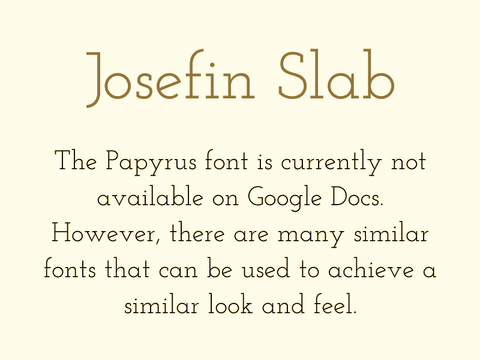
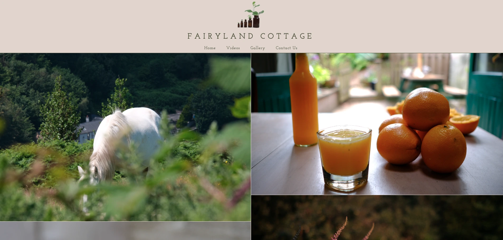
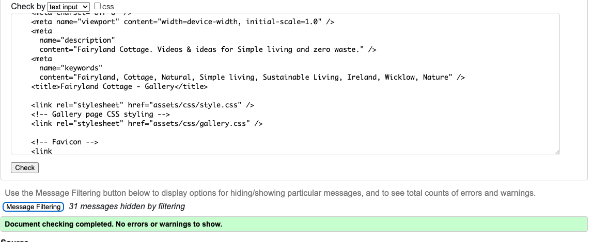
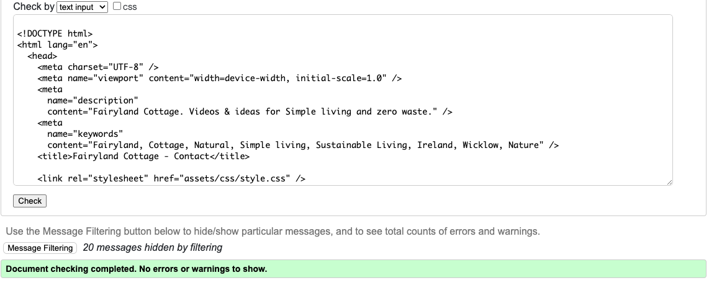

# FAIRYLAND COTTAGE - NEW WEBSITE

## Description

This project website is a resource for individuals interested in living a simple and sustainable lifestyle. It offers a variety of information on topics such as healthy recipes, homemade natural products, DIY projects, and zero waste living. Whether you are a seasoned follower of the _Fairyland Cottage_ or a newcomer looking to learn more, this website provides valuable insights and inspiration for anyone interested in simplifying their life.


## Table of Content

1. [User Stories](#user-stories)

2. [Visual Design](#visual-design)

3. [Features](#features)

4. [Technologies](#technologies)

5. [Manual Testing](#manual-testing)

6. [Deployment](#deployment)

7. [Credits](#credits)

8. [Author](#author)

<hr>

## [User Stories](#user-stories)

### Short Brief

I wanted a website for users old and new to able explore the world of _Fairyland Cottage_ without having to go to different sites / apps. If they wish to see more they have the option through our links provided.
On the home page we give a warming welcome note and a insight into simply living. This allows the new user to get a strong understanding of what information is available.

#### Users views

1. As a user, I want to easily navigate through the website to find the information I am looking for, so I can quickly access the world of _Fairyland Cottage_ resources on simple living and sustainability.

2. As a newcomer to _Fairyland Cottage_, I want to learn more about the ethos of simple living and sustainability, so I can understand the principles and values behind the content shared on the website.

3. As a user interested in zero waste living, I want to discover tips and ideas on how to reduce waste and live a more eco-friendly lifestyle, so I can make positive changes in my daily habits.

4. As a fan of _Fairyland Cottage_, I want to stay connected with the community through social media links, so I can engage with like-minded individuals and be inspired by their stories and experiences.

5. As a visitor to the website, I want to feel inspired and motivated to adopt a more sustainable lifestyle, so I can contribute to a healthier planet for future generations.

## [Visual Design](#visual-design)

### Wireframes

- Small Screen / Mobile

  |                                          Visual idea                                          |     Page     |
  | :-------------------------------------------------------------------------------------------: | :----------: |
  |     | Landing page |
  |      |   Side bar   |
  |   | Gallery page |
  |   |    Videos    |
  |  |  Contact Us  |

  <hr>

- Screen sizes 768px and up

  |                                   Visual idea                                   |     Page     |
  | :-----------------------------------------------------------------------------: | :----------: |
  |     | Landing page |
  |  | Gallery page |
  |    |    Videos    |
  |  |  Contact Us  |

  ### Font

  The font that I chose for the full site is [Josefin Slab](https://fonts.google.com/?query=Josefin+Slab). The reasoning behind this choice is to keep in form with the original font used for the existing [Fairyland Cottage website](https://www.fairylandcottage.com/) where Papyrus was the main font. Unfortunately google fonts did not offer this option, so I found a good [blog](https://appsthatdeliver.com/app-tutorials/google-docs/papyrus-font-google-docs/) that offered alternative fonts that held a similarity to the font design Papyrus.

  I aimed to create a seamless transition for returning users, evoking a sense of familiarity with the world of Fairyland, while new visitors are welcomed with the organic and earthy aesthetic of Josefin Slab font, enhancing their reading and browsing experience on the site.

  

  ### Icons

  - The icons I used are from the [Fontawesome]() Icon library using the <<i>i</i>> tag.

  - They are utalised is the footer on pages 768px and up. While added to the side bar on mobile devices.

  
  

  ### Colors

  - I used the site [coolors](https://coolors.co/ded5cd-f3eae2-41462d-e9ead6) to create the color pallet.

  - I strive for the website to offer users a sense of rooted-ness and a strong connection to nature.

  - I selected the drab dark brown color to evoke a sense of organic connection to the earth, bridging the tones of the soil and forest greens. This choice allows it to contrast and stand out against the lighter hues present throughout the site.

  

  ### [Images](#images)

  On the **landing pages** I chose two hero images.

  - The prime hero image displayed on the website with a viewport size of 768px and above features an exquisite portrayal of the cottage. This deliberate choice aims to imbue users with a sense of warmth and hospitality upon entering the enchanting realm of _Fairyland Cottage_.

    

  <br>

  - I selected a distinct hero image specifically tailored for mobile screens. The objective was to maintain a mystical and inviting ambiance while optimizing the vertical space available on mobile devices. The choice of a moss-filled tree with a subtle glimmer of sun rays effectively captures the desired atmosphere that aligns with the site's overall aesthetic.

    

    <hr>

  On the **Contact page**, the goal is to evoke a sense of closeness and connection with the user through the imagery, emphasizing the contact form as a means to facilitate this connection. By employing a technique that emphasizes the foreground over a blurred image of Niamh, these visuals are carefully curated to convey a feeling of emotional proximity and engagement.

  - The **Contact page** image for 786px and up.

    

    <br>

  - The **Contact page** image for mobile devices.

    

## [Features](#features)

### Page Elements

### **_All Web Pages_**

#### - Navbar

##### 768px & up Navbar

- The navbar design for screens 768px & up prioritizes simplicity, cleanliness, and minimalism. It effectively guides users with links to each page, ensuring easy navigation. Additionally, the inclusion of an image logo offers users a quick way to return to the home page from any section of the website.

  

##### - [Sidebar](#sidebar)

- On smaller devices like mobile phones, the navbar adapts its layout to a side bar format to optimize screen space. This transition enhances the user experience by providing more visible content on the limited screen real estate of mobile devices. The sidebar design effectively organizes page links and can be toggled by clicking the 3 dots icon, offering a streamlined navigation experience.

- To further enhance usability on small screens, where space constraints may limit the visibility of a footer, social media links have been integrated within the side bar. This strategic placement ensures that users can easily access and engage with social media platforms without compromising the overall navigation experience on smaller devices.<br>

   

#### - Footer

- The footer features a simple and minimalist design to maintain consistency with the headers layout.

- Includes only social media links and website copyright information for streamlined navigation.

- Social media links direct users to separate webpages for YouTube and Instagram, opening in a new tab for enhanced user experience.


<br>
<hr>

### **_Landing Page_**

The landing page displays one of two hero images located in the [images](#images) section of this README, with the image being dynamically selected based on the screen size of the device.

- There are also two text sections:

  1. The initial component comprises a salutation directed towards both new and returning users, accompanied by a succinct overview of the site's offerings & functionalities.

     

  <br>

  2. This section highlights the principles of a simple living ethos, emphasizing the importance of sustainable practices such as minimalism, waste reduction and renewable resources. It underscores the benefits of simplifying our lives, focusing on what matters most, and integrating nature into our daily routines to promote a more sustainable and fulfilling lifestyle for both individuals and the environment.

     

<br>
<hr>

### **_Videos Gallery_**

Within the videos page, there are three distinct sections that cater to various aspects of the _Fairyland Cottage_ ecosystem. These sections are designed to support and promote the ethos of the simplified living ethos lifestyle.

**- Three dots**

In order for the user to switch between each video, they will need to utilize the three dots displayed underneath the videos. This functionality is exclusive to device screens with a width of 768px or larger. The presence of the three dots is intended to maintain consistency with the 3 dots icon located in the [sidebar](#sidebar).


<br>

**- Mobile devices**

For small devices, a revised layout has been implemented to optimize the horizontal orientation of mobile devices. This layout displays three available videos for user access.


<br>

**- Video Category's**

1.  The first video section intermittently presents a substantial challenge for some users, as they may lack the necessary information, support, or guidance to navigate this aspect effectively. In response, I have curated a selection of calming and motivational videos to ease users into the process and demonstrate that success in this area is within reach.<br><br>
    <br><br>
2.  The second video section provides users with an illustration of the simplicity and benefits of a peaceful lifestyle. These videos offer a glimpse into a tranquil way of living.<br><br>
    <br><br>
3.  In the concluding video section, I have included content focused on a minimal lifestyle, as this step is essential in the process of relinquishing perceived necessities. These videos serve as a guide for individuals and families in achieving this outcome.
    <br><br>

<br>
 <hr>

### **_Image Gallery_**

The primary function of the image gallery page is to provide users with a visual representation of _Fairyland Cottage_, showcasing moments frozen in time. Additionally, it serves as a source of visual relaxation for individuals who may prefer images over videos or have limited time to watch them.

**- Page layout**

The page layout dynamically adjusts based on the user's device.

- For devices with a maximum width of 1023px, the display is configured to be in a single column layout.<br><br>

<br>

- For devices with a minimum width of 1024px and higher, the layout will adjust to a two-column display.<br><br>

In order to optimize user experience, I have limited the display to a maximum of two columns to prevent users from being inundated with excessive visual information.

<br>
<hr>

### **_Contact Page_**

## [Technologies](#technologies)

- ### Languages

  [HTML](https://www.w3schools.com/html/) - Website markup.<br>
  [CSS](https://www.w3schools.com/css/) - Website Styling.

- ### Platforms

  [Github](https://github.com/) -Remote code storage and deployment of site.<br>
  [VS Code](https://code.visualstudio.com/) - IDE for code editing / project development.

- ### Other Tools

## [Manual Testing](#manual-testing)

### Code Validation

- To validate the **HTML** I used [W3 Validator](https://validator.w3.org).

1.  #### Landing Page:

    

2.  #### Video Page: <br>

    On first test I found an error regarding **alt** on all iframe elements -
    

    To solve the error I changed **alt** to **name** -
    

3.  #### Gallery Page:

    

4.  #### Contact Page:
    

- To validate the **CSS** I used [W3C CSS Validator](hhttps://jigsaw.w3.org/css-validator/).

1.  #### Landing Page:

    

2.  #### Video Page: <br>

    

3.  #### Gallery Page:

    

4.  #### Contact Page:
    

<hr>

### Lighthouse Results

1.  #### Landing Page:

    ##### Mobile -

       
      
    ##### Desktop - 
      

2.  #### Video Page:

    ##### Mobile -

    
      
      ##### Desktop - 
    

3.  #### Gallery Page:

    ##### Mobile -

       
      
    ##### Desktop - 
      

4.  #### Contact Page:

    ##### Mobile -

       
      
    ##### Desktop - 
      

<hr>

### General site Testing

- I performed thorough testing on the website using my Android device to verify the functionality of all buttons, features, and the contact form. Subsequently, I tested the site on an iOS device belonging to my wife to confirm compatibility with Apple devices, which proved successful.

## [Deployment](#deployment)

This project is deployed using GitHub Pages. This section provides information on how to deploy & as a reference for future deployments.

### Accessing the Deployed Website

To access click on the link and visit [Fairyland Cottage](https://terryloc.github.io/Fairyland-Cottage/).

### How to Deploy

1. Fork the repository by clicking the "Fork" button at the top of the repository page.
2. Clone the forked repository to your local machine using the `git clone` command.
   ```
   git clone https://github.com/your-username/Fairyland-Cottage.git
   ```
3. Make any necessary changes or updates to the project.
4. Commit your changes and push them to your GitHub repository.
   ```
   git add .
   git commit -m "Your commit message"
   git push origin main
   ```
5. Navigate to the repository settings on GitHub.
6. Under the GitHub Pages section, choose the main branch as the source and save the changes.
7. Your site will be published and accessible at `https://your-username.github.io/Fairyland-Cottage/`.

## [Credits](#credits)

## [Author](#author)

- [@TerryLoc](https://github.com/TerryLoc)

Thank you for reading!
